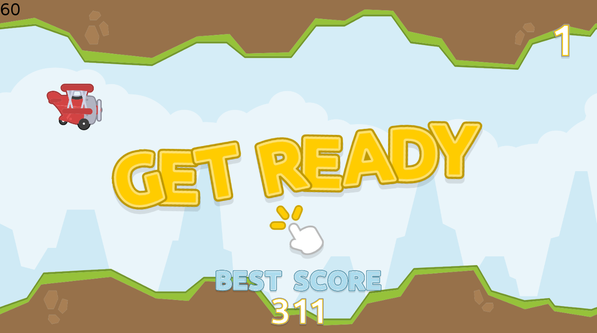

LÖVE Planes
===========

[](http://love2d.org/)

Fly your aircraft without crashing onto the walls.
LÖVE 2D sample game.




How to run it
-------------

```
git clone https://github.com/guiferviz/love-planes
love love-planes/.
```

or you can download the `love-planes.love` from the releases section ([https://github.com/guiferviz/love-planes/releases/](https://github.com/guiferviz/love-planes/releases/)).


Android
-------

This repository contains an Android app under the `android` folder. Go to the LÖVE Android repository for build instruccions ([https://bitbucket.org/rude/love/](https://bitbucket.org/rude/love/)) or you can download an already compiled `love-planes.apk` from the releases section ([https://github.com/guiferviz/love-planes/releases/](https://github.com/guiferviz/love-planes/releases/)).


Authors
-------

* [Guiferviz](mailto:guiferviz@gmail.com)
  
* [Rosenn23](mailto:rosenn23@gmail.com)

